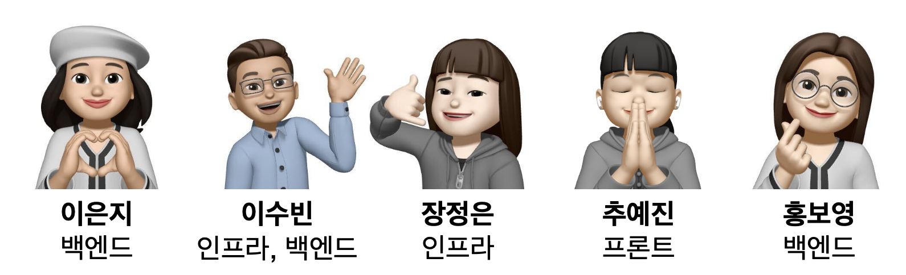
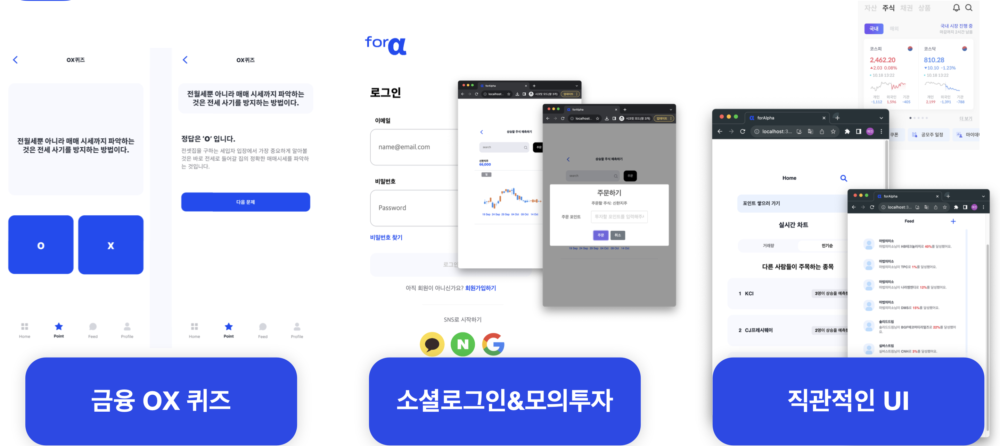
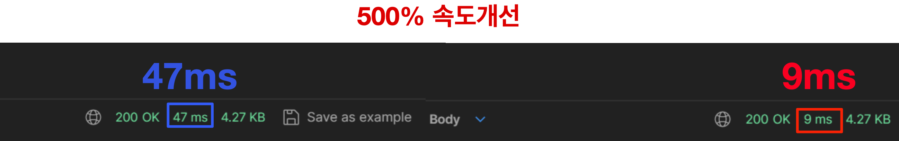
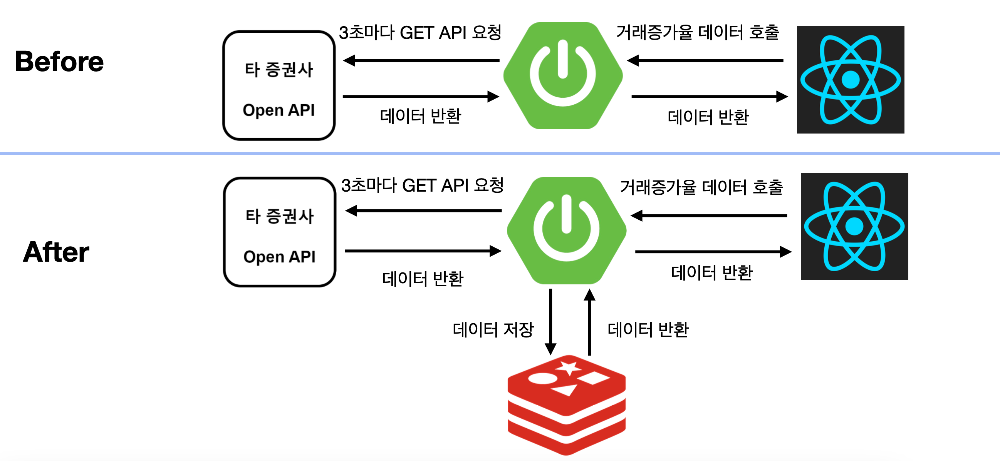
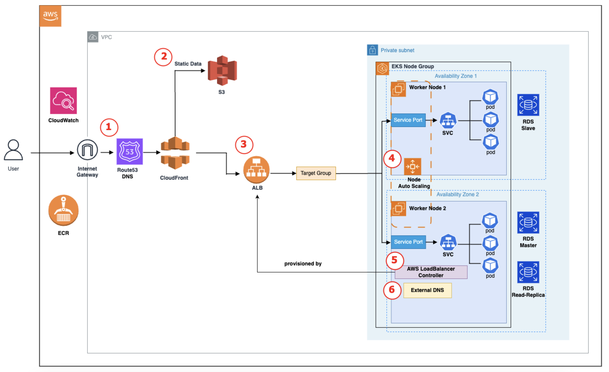
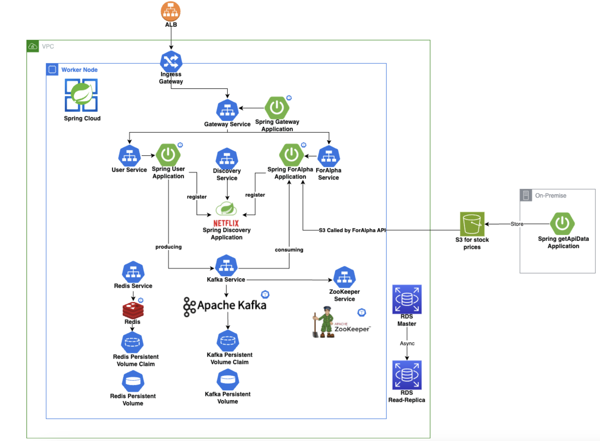
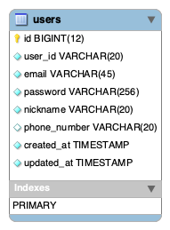
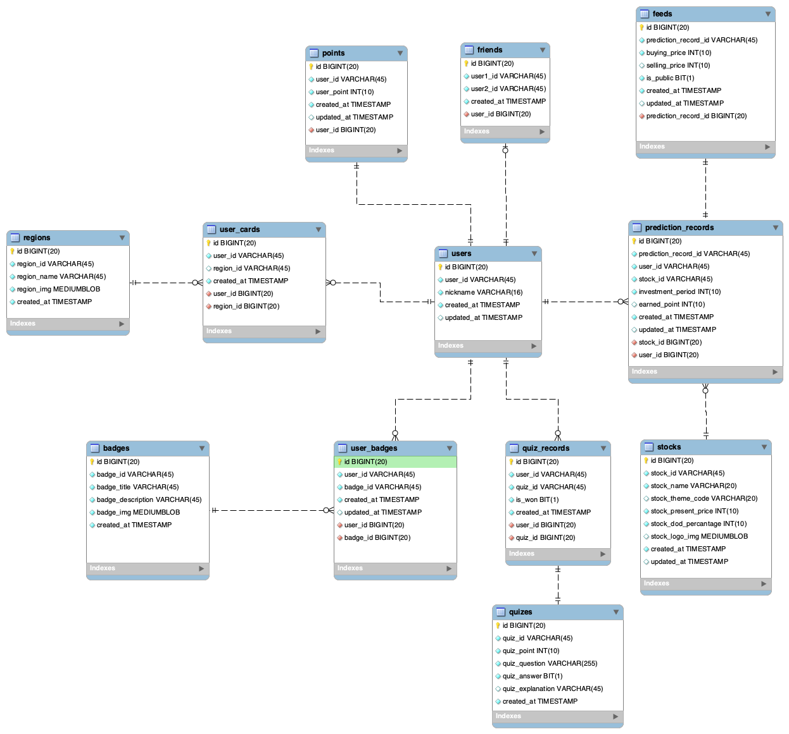

# 프로디지털아카데미란?

```
  - 총 512시간의 금융개발 실무교육
  - 클라우드 환경 기반의 풀스택 개발 과정 학습
  - 신한투자증권 실무에 바로 활용 가능한 능력 배양/활용
  - 핀테크 산업에 필요한 전반적인 ICT 능력 배양
```

# **사용 기술**

<table>
<tr>
<td align="center">
  
### FrontEnd


</td>
<td align="center">
  
### BackEnd

[](https://spring.io/)
[](https://spring.io/)
[](https://mariadb.org/)
[](https://redis.io/)
[](https://www.docker.com/)
[](https://kafka.apache.org/)

</td>

<td align="center">

### AWS

[](https://aws.amazon.com/route53/)
[](https://aws.amazon.com/s3/)
[](https://aws.amazon.com/ecr/)
[](https://aws.amazon.com/rds/)
[](https://aws.amazon.com/eks/)
[](https://aws.amazon.com/autoscaling/)
[](https://aws.amazon.com/elasticloadbalancing/)

<td>

### UX·UI


</td>
</tr>
</table>

<hr/>

## 주식 초보자들을 위한 서비스, ForAlpha

- **개발 및 발표 준비 기간 : 10/7 - 10/20, 약 14일**
- **증권에 익숙치 않은 사용자 입장에서 기존 증권관련 모바일 앱 분석**
  ```
  - 실제 돈을 잃을 수도 있다는 두려움
  - 번거로운 계좌 개설
  - 어려워 보이는 많은 수치와 차트
  - 주식 관련 용어 학습 필요
  ```

<hr/>

- **제안 및 해결안 도출**

  > 1. 포인트를 활용한 모의투자 기능
  > 2. 소셜로그인 기능 제공
  > 3. 어려워보이지 않도록 직관적인 UI 도입
  > 4. 교육을 위한 금융 관련 OX 퀴즈 제공

- **왜, MSA?**

  > 1. 모의투자, OX 퀴즈 등 기존의 미니게임 외 빠른 확장 가능
  > 2. 우선적으로 User, Main으로 나누어 User 서비스 중단 시 Main 내 포인트 관련 로직 수행 가능
  > 3. EKS 상의 배포를 통해 Cloud Native 환경 학습

---

## 프로젝트 내 역할



> 1. 이은지 : Open API 활용, 예측 서비스 개발, 캐싱 설계, 요구사항 변경에 따른 전체적인 수정
> 2. 이수빈 : ERD 설계, Spring Cloud 활용 MSA 구축, kompose 활용 k8s yml 작성, User, Gateway, Discovery Service 개발, Main 내 투자 내역 및 분석 API, CQRS Pattern 활용 DB 이중화
> 3. 장정은 : Cloud Architecture 설계 및 EKS 배포
> 4. 추예진 : Figma 활용 UI 설계 및 FrontEnd 전체
> 5. 홍보영 : CRUD API 설계 및 FrontEnd와 API 연동 디버깅

## FrontEnd

> 

## Backend

### 캐싱 설계

>  

### Cloud Architecture

> 

### System Architecture

> 

### ERD

#### User Service

> 

#### Main Service

> 

<hr/>

### 발표 자료

> https://drive.google.com/file/d/1OQykCvLUHL1hUwxhhqQmPhUNsuknxmmo/view?usp=drive_link
